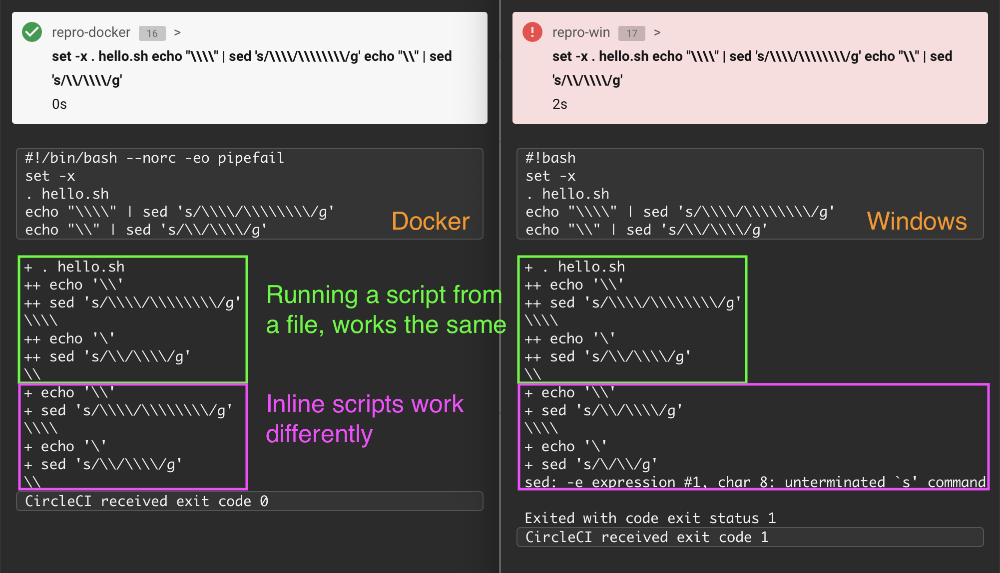

# Issue with escaping backslashes on Windows VMs

There are two identical jobs in <.circleci/config.yml>, one running on a Windows
VM and one on Docker.

First step is to run a bash script stored in a file, and it should print one
backslash. This step runs equally well on both executors.

Second step is an bash script inlined in the CircleCI config file, and it does
the same thing. This step works as expected on a Docker VM, but breaks on
Windows. It seems like every backslash should be additionally escaped in this
case.

Contact: Misha Karpenko misha@pitch.io
